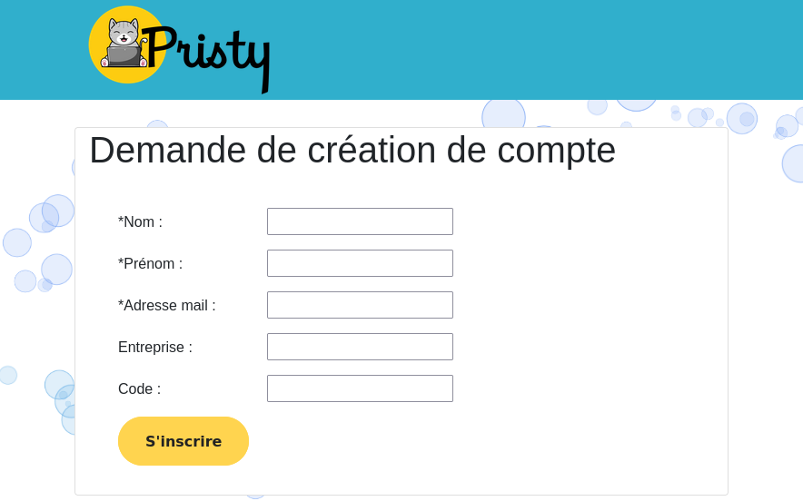
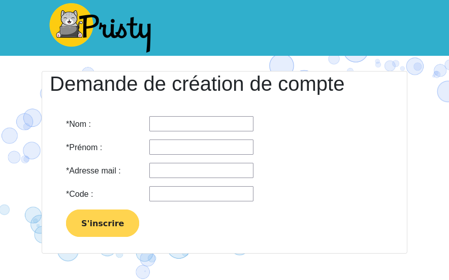

# Formulaire de création d'Utilisateur et d'Espace de travail

## Description

Module permettant la création d'un utilisateur et d'un espace de démonstration pour tester Pristy.

Si vous êtes un **administrateur de compte**, vous pourrez créer des comptes utilisateurs avec un nouvel *Espace de travail* associé. Les comptes utilisateurs créés seront **gestionnaire** de leur *Espace de travail*, nouvellement créé, et auront aussi la possibilité d'inviter de nouveaux utilisateurs dans cet *Espace de travail*.
Ils auront aussi la possibilité de créer de nouveaux *Espaces de travail*.
L'utilisateur créé recevra un mail avec ses identifiants et un **code** qui lui permettra de créer de nouveaux utilisateurs qui seront automatiquement ajouté comme **gestionnaire** de l'*Espace de travail* correspondant au **code**.

Si vous êtes un utilisateur standard et que vous avez reçu un **code** d'inscription à un *Espace de travail*, vous pourrez créer des comptes utilisateurs. Ces utilisateurs seront automatiquement ajouté dans l'*Espace de travail* correspondant au **code**.
Ils recevront un mail avec leurs identifiants.

> Url du formulaire d'inscription : `host:port`/alfresco/s/fr/jeci/signin/create-user


## Configuration

Plusieurs paramètres sont à définir dans le fichier `alfresco-global.properties` :

* `create_user_cloud.site_modele.shortName` : identifiant du site contenant les modèles de dossier et de document à intégrer dans l'*Espace de travail* créé
* `create_user_cloud.inbox_mail_copy` : adresse mail du compte qui recevra une copie des mail envoyés aux utilisateurs lors de leur création

Une fois l'extension installée :

* ajouter les personnes ou groupes qui seront **adminitrateurs de compte** dans le groupe `CREATE_USER_ADMINISTRATORS`
* ajouter le groupe `CREATE_USER_ADMINISTRATORS` en tant que lecteur sur l'*Espace de travail*, défini ci-dessus, contenant les modèles de dossier et de fichier

## Utilisation

### Administrateur de comptes



Vous devez remplir soit le **code**, soit l'**entreprise**.

1. Si vous remplissez le champ **code**, l'utilisateur sera ajouté dans l'*Espace de travail* correspondant.

2. Si vous remplissez le champ **entreprise**, il sera utilisé pour créer le nouvel *Espace de travail*. Si un *Espace de travail* existe déjà avec ce nom d'entreprise, l'utilisateur sera ajouté au site existant.

### Utilisateur standard



Tous les paramètres sont obligatoire. La création de l'utilisateur ne fonctionnera que dans le cas où le **code** saisi correspond à un site existant.

> Ce formulaire ne peut pas être utilisé pour ajouter un utilisateur existant dans un site.

### Test

```
mvn resources:resources
pip install docker-compose
docker-compose -f ./target/classes/docker-compose.yml up --build -d
```

Accès au formulaire : `http://localhost:8080/alfresco/s/fr/jeci/signin/create-user`
